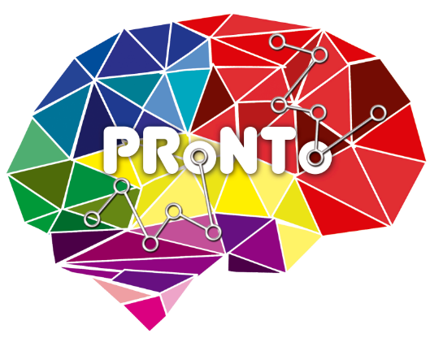
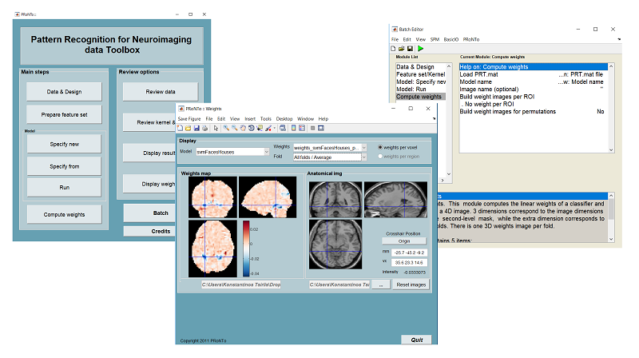

# PRoNTo — Pattern Recognition for Neuroimaging Toolbox &nbsp;

<p align="center">
  
</p>

<p align="center">
  <a href="https://www.gnu.org/licenses/gpl-2.0.html"></a>
  <a href="https://github.com/MLNL/PRoNTo_public/releases"></a>
  <a href="http://www.mlnl.cs.ucl.ac.uk/pronto/"></a>
</p>

**PRoNTo** is a MATLAB-based software toolbox for the analysis of neuroimaging data using pattern recognition and machine learning methods. Developed by the [Machine Learning & Neuroimaging Laboratory (MLNL)](http://www.mlnl.cs.ucl.ac.uk) at University College London, led by **Prof. Janaina Mourao-Miranda**.

---

## Table of Contents

- [Overview](#overview)
- [Prediction Frameworks](#prediction-frameworks)
- [Requirements](#requirements)
- [Installation](#installation)
- [Getting Started](#getting-started)
- [Documentation](#documentation)
- [Datasets](#datasets)
- [Tutorials](#tutorials)
- [Courses](#courses)
- [How to Cite](#how-to-cite)
- [Credits](#credits)
- [License](#license)
- [Contributing](#contributing)
- [Contact & Mailing List](#contact--mailing-list)

---

## Overview

The Pattern Recognition for Neuroimaging Toolbox (PRoNTo) is an open-source MATLAB toolbox that brings machine learning methods to neuroimaging, enabling classification and regression of brain-imaging and non-imaging data.

One unique feature of PRoNTo is the use of **regularized linear kernel methods** that enable computationally efficient and generalizable models with high-dimensional data, even when the number of features exceeds the number of samples — a common situation in many neuroimaging studies. Kernel methods represent data implicitly through a kernel function that encodes pairwise similarity and can capture linear or nonlinear relationships.

PRoNTo also uses **Multiple Kernel Learning (MKL)** to combine information from several kernels, where each kernel can correspond to different modalities (imaging and non-imaging) or feature groupings (e.g. regions of interest). Since version 3.1, this capability has been extended with the **Elastic-net Multiple Kernel Learning (ENMKL)** ([arXiv preprint](https://arxiv.org/abs/2512.11547)).

Since version 3.0, PRoNTo also includes **non-kernel machines**, which can be beneficial when the data is not very high-dimensional (e.g. psychometric data).

**PRoNTo v3.1** (released 2026) accepts:
- NIfTI format images (sMRI, fMRI, PET, DTI, betas/contrasts)
- Numerical arrays in `.mat` files (e.g. connectivity or psychometric data)
- M/EEG data in SPM's `@meeg` data format

PRoNTo bridges the gap between the **machine learning** and **neuroimaging** communities — giving ML researchers a neuroimaging platform to contribute novel models, and giving neuroscientists powerful tools unavailable in standard analysis software.

---

## Prediction Frameworks

PRoNTo supports two families of prediction frameworks — **linear kernel-based** and **linear non-kernel** — each available for single and multi-modality data.

**Linear kernel-based** — recommended when number of features $\gg$ number of subjects

| 1a — Single modality prediction | 1b — Multimodal prediction | 1b (variant) — Multi-grouping prediction |
|:---:|:---:|:---:|
|  |  |  |
| `single linear kernel` | `linear MKL / sum of kernels` | `linear MKL / sum of kernels` |

| 1c — Multimodal + grouping within modalities |
|:---:|
|  |
| `linear MKL / sum of kernels` |

**Linear non-kernel** — recommended when number of features $\ll$ number of subjects

| 2a — Non-kernel single modality | 2b — Non-kernel multi-modality |
|:---:|:---:|
|  |  |
| `primal model` | `primal model` |

**[See full framework diagrams → docs/figures.md](docs/figures.md)**
Visual illustrations of each framework with descriptions, when to use them, and tutorial examples.

---

## Requirements

| Requirement | Details |
|---|---|
| **MATLAB** | R2017b–R2024b. Statistics Toolbox required for some plots. Minor GUI window display issues and a known file selector error may appear in MATLAB R2025a (and probably later versions) — see [FAQ](/blob/main/docs/faq.md) for details and workaround. |
| **SPM** | SPM12, SPM25 or SPM26. SPM25 or SPM26 recommended. [Download SPM](https://www.fil.ion.ucl.ac.uk/spm/) |
| **OS** | Windows, Mac OS (Intel & Apple Silicon), Linux (64 bit) |

> **Note:** Some routines are compiled C++ (`.mex` files). Pre-compiled binaries are provided for common platforms. If your platform is unsupported, recompile per the [manual](docs/manual.md).

---

## Installation

1. Download the latest release from the [Releases page](https://github.com/MLNL/PRoNTo_public/releases) on GitHub.
2. Unzip to a folder of your choice.
3. Open MATLAB, then add PRoNTo and SPM to the MATLAB path:

  ```matlab
  addpath('/path/to/pronto')
  addpath('/path/to/spm')
  ```

4. Launch PRoNTo:

  Type
  ```matlab
  pronto
  ```
  or
  ```matlab
  prt
  ```
  at the comamnd line.

For full installation details, see the [manual](docs/manual.md).

> **Mac users:** please see the [Mac-specific installation instructions](docs/instructions-for-mac.md) for help with Gatekeeper warnings and compiler issues.

---

## Getting Started

- Browse the **[prediction frameworks](docs/figures.md)** to choose the right approach for your data.
- Read the **[manual](docs/manual.md)** for a complete description of all functionalities.
- Download one of the **[example datasets](docs/datasets.md)** and follow the tutorial chapters.
- Check the **[FAQ](docs/faq.md)** for help with installation, inputs, cross-validation, and interpreting results.

---

## Documentation

| Document | Description |
|---|---|
| [Prediction Frameworks](docs/figures.md) | Visual overview of the three prediction frameworks |
| [Methods](docs/methods.md) | Why PRoNTo uses linear kernel methods — explained for neuroimagers |
| [Manual](docs/manual.md) | Full reference manual (also at `PRoNTo/manual/prt_manual.pdf`) |
| [Mac Instructions](docs/instructions-for-mac.md) | Installation guide for Mac users |
| [FAQ](docs/faq.md) | Frequently asked questions |
| [Datasets](docs/datasets.md) | Benchmark datasets for tutorials |
| [Tutorials](docs/tutorials.md) | Video tutorials showing how to use PRoNTo |
| [Courses](docs/courses.md) | Course slides and previous course dates |
| [How to Cite](docs/citation.md) | Citation instructions |
| [Credits](docs/credits.md) | Team and sponsors |
| [History](docs/history.md) | Development history |
| [Release Notes](CHANGELOG.md) | Version history |

---

## Datasets

Example datasets for the PRoNTo tutorials are listed in [`docs/datasets.md`](docs/datasets.md), including:

- Haxby fMRI dataset (Faces & Objects)
- OASIS structural MRI dataset
- IXI dataset
- Multimodal Face Recognition dataset
- Simulated ECoG dataset

---

## Tutorials

📹 [Video tutorials showing how to use PRoNTo](https://github.com/MLNL/PRoNTo/blob/main/docs/tutorials.md) are available in [`docs/tutorials.md`](docs/tutorials.md). The tutorials cover step-by-step demonstrations using real neuroimaging datasets.

---

## Courses

PRoNTo courses have been held periodically, introducing pattern recognition in neuroimaging and demonstrating the toolbox. There are currently no courses scheduled. For the full 2021 course including lectures and slides, see the [2021 PRoNTo Course page](http://www.mlnl.cs.ucl.ac.uk/pronto/prtcourse_2021.html). Course slides and previous course dates are available in [`docs/courses.md`](docs/courses.md).

---

## How to Cite

Please see [`docs/citation.md`](docs/citation.md) for information on how to cite PRoNTo.

---

## Credits

Developed by the [MLNL at UCL](http://www.mlnl.cs.ucl.ac.uk). See [`docs/credits.md`](docs/credits.md) for the full team and sponsors.

---

## License

PRoNTo is free software under the **[GNU General Public License v2](https://github.com/MLNL/PRoNTo_public/blob/main/LICENSE)** (or any later version).

---

## Contributing

Contributions are welcome — new features, bug fixes, documentation, and demo data. At present, PRoNTo does not have a dedicated person managing developments or providing support. If you are interested in contributing, please contact [**Prof. Janaina Mourao-Miranda**](https://github.com/mouraomiranda) or [**Prof. Christophe Phillips**](https://github.com/ChristophePhillips) — see the [Contributing guidelines](CONTRIBUTING.md) for more details.

---

## Contact & Mailing List

For bug reports and questions, use [GitHub Issues](https://github.com/MLNL/PRoNTo_public/issues) or the PRoNTo mailing list — see [`docs/mailing-list.md`](docs/mailing-list.md). Please note that response times may vary as there is currently no dedicated support person for PRoNTo.
