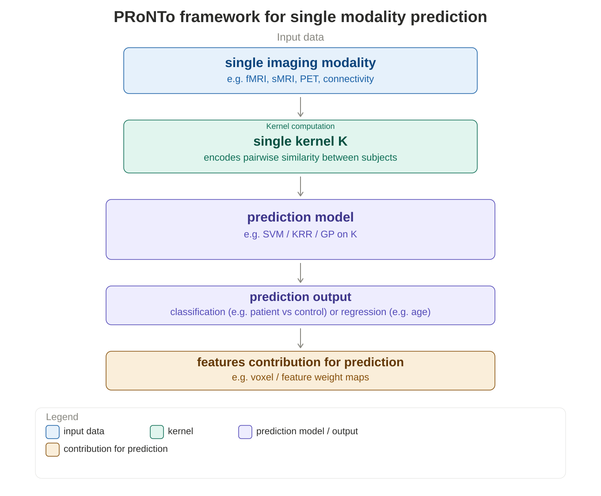
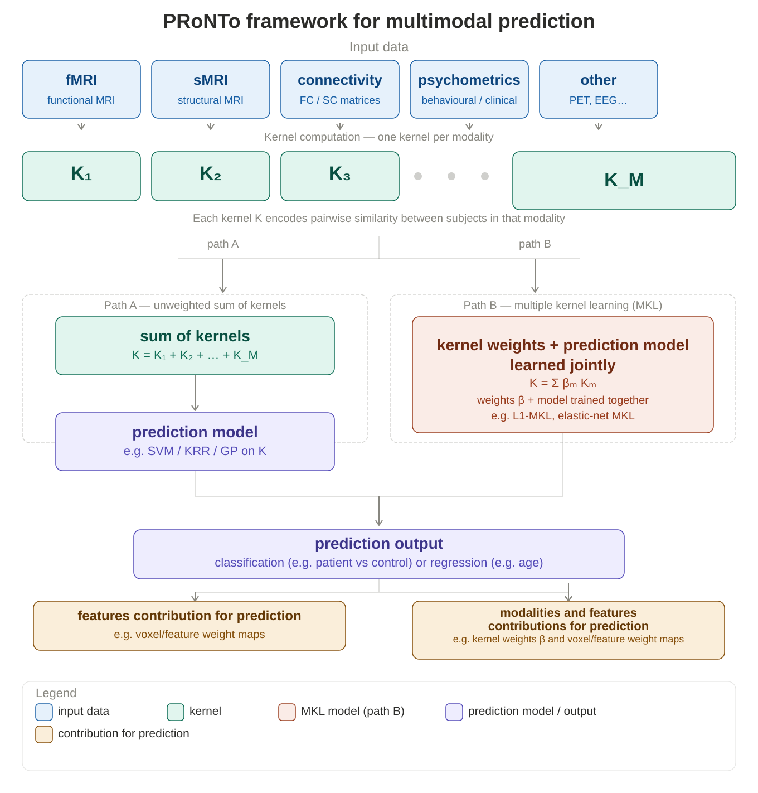
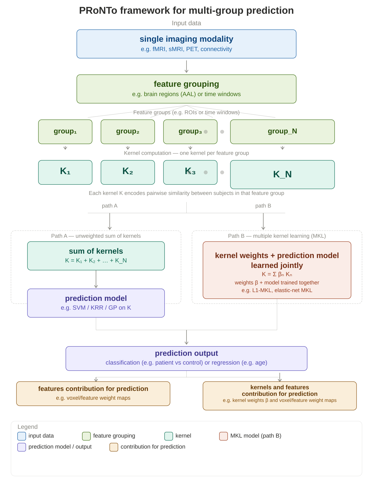
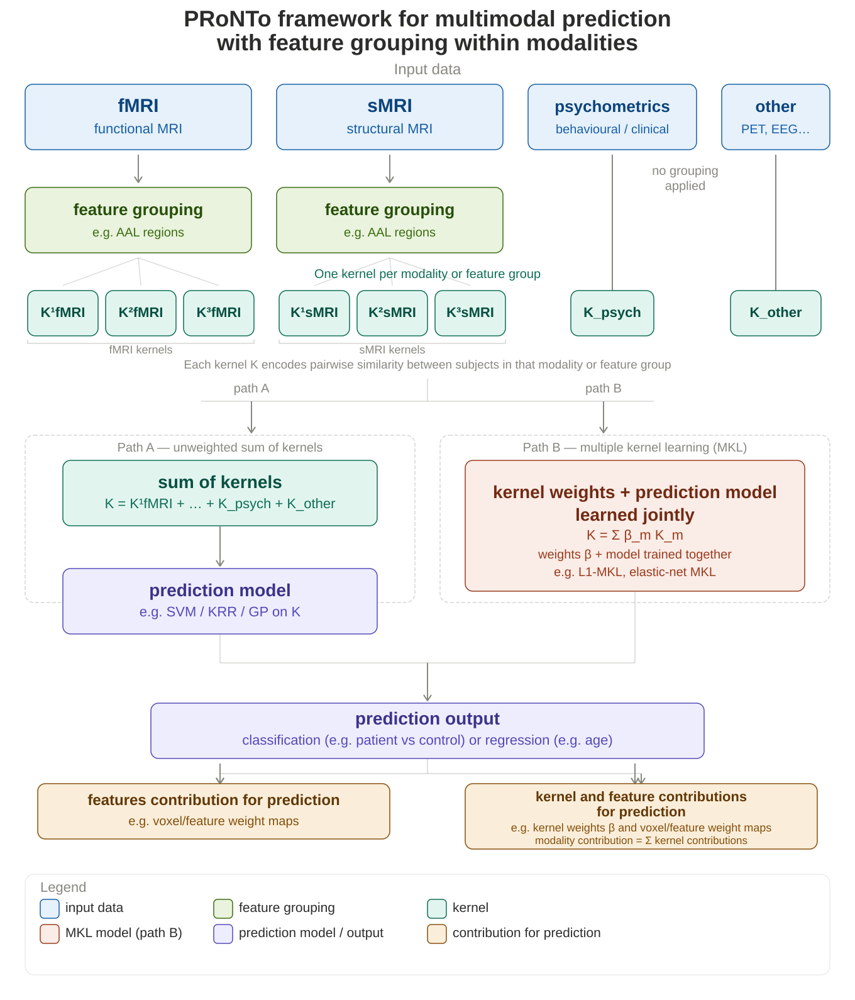
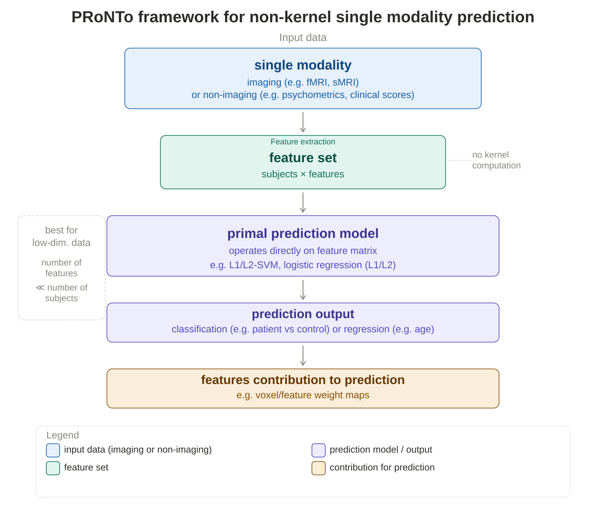
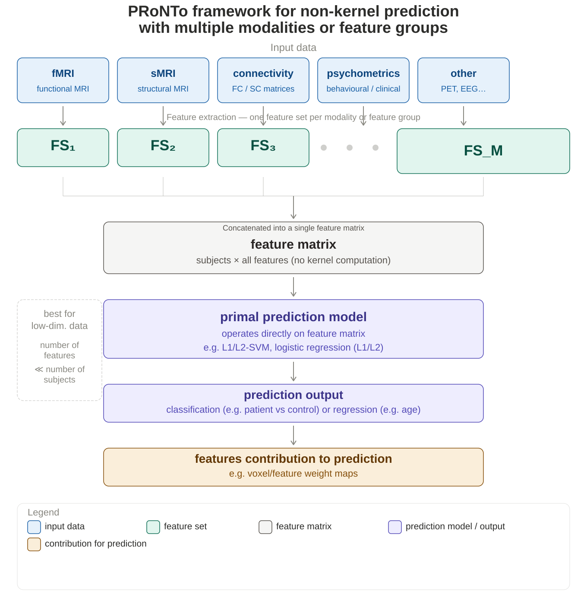

# PRoNTo Prediction Frameworks

PRoNTo supports two families of prediction frameworks — **linear kernel-based** and **linear non-kernel** — each available for single and multi-modality data.

**Choosing between kernel and non-kernel:** Linear kernel-based methods are recommended for high-dimensional neuroimaging data (number of features $\gg$ number of subjects). Linear non-kernel (primal) methods are recommended when data dimensionality is low (number of features $\ll$ number of subjects), such as psychometrics or connectivity matrices with few features.

For step-by-step instructions, see the [manual](manual.md) and the [tutorial datasets](datasets.md).

---

## Linear kernel-based frameworks

*Recommended when number of features* $\gg$ *number of subjects*

In these frameworks, data is represented through a kernel matrix encoding pairwise similarity between subjects. Multiple modalities or feature groups can be combined either by summing their kernels equally (Path A) or by learning an optimal weighted combination jointly with the prediction model via Multiple Kernel Learning — MKL (Path B).

---

## Framework 1a — Single modality prediction

**When to use:** You have a single modality and want to build a predictive model using all features as a single kernel.

**How it works:** One linear kernel is computed from the single modality, encoding pairwise similarity between subjects. This kernel is then used to train a prediction model (e.g. SVM, KRR, or GP). The output includes the prediction (classification or regression) and voxel/feature weight maps showing which features drove the prediction.

**Typical examples:**
- Classifying face vs house viewing from whole-brain fMRI (Haxby dataset)
- Predicting age from whole-brain structural MRI (IXI dataset)

  

---

## Framework 1b — Multimodal prediction

**When to use:** You have several imaging or non-imaging modalities (e.g. fMRI, sMRI, connectivity, psychometric data) and want to combine them into a single predictive model.

**Path A — unweighted sum of kernels:** All modality kernels are summed with equal weight into a combined kernel, which is then used to train a prediction model (e.g. SVM or KRR).

**Path B — Multiple Kernel Learning (MKL):** The kernel weights β and the prediction model are learned jointly. MKL algorithms (e.g. L1-MKL, elastic-net MKL) learn an optimal weighted combination of the modality kernels. The learned weights reveal which modalities contribute most to the prediction.

**Typical examples:**
- Combining fMRI, EEG, and MEG for multimodal face recognition (Multimodal Face Recognition dataset)
- Combining structural MRI and psychometric measures for clinical prediction

  

> **Note on kernel normalisation:** When using multiple kernel learning (MKL), it is recommended to normalise each kernel before combining them. Normalisation accounts for the fact that kernels are computed from feature sets of different sizes — without it, modalities with more features tend to dominate the combined kernel. This applies to all MKL frameworks using multiple kernels.

---

## Framework 1b (variant) — Multi-grouping prediction

**When to use:** You have one imaging modality and want to understand which brain regions (or time windows) drive the prediction, by computing one kernel per feature group.

**How it works:** The imaging data is partitioned into feature groups using a segmentation scheme — for example a brain atlas (e.g. AAL) to define brain regions, or time windows for M/EEG data. One linear kernel is computed per feature group. As in Framework 1b, you can either sum all kernels equally (Path A) or use MKL to learn optimal kernel weights jointly with the prediction model (Path B). The output includes both the prediction and the contribution of each feature group.

**Typical examples:**
- Atlas-based MKL classification using AAL regions (Haxby dataset)
- Time-window MKL for M/EEG decoding (Simulated ECoG dataset)

  

> **Note on kernel normalisation:** See [Framework 1b](#framework-1b--multimodal-prediction) for the kernel normalisation note, which also applies to this framework.

---

## Framework 1c — Multimodal prediction with feature grouping within modalities

**When to use:** You have multiple modalities and at least some of them have a natural feature grouping (e.g. brain atlas for fMRI and sMRI), while others (e.g. psychometrics) do not. Each group within a modality produces its own kernel, so the total number of kernels can exceed the number of modalities.

**How it works:** Modalities with feature grouping (e.g. fMRI and sMRI split by AAL regions) produce one kernel per group. Modalities without grouping (e.g. psychometrics) produce a single kernel as in Framework 1b. All kernels are then combined via Path A (unweighted sum) or Path B (MKL). For modalities with multiple kernels, the modality contribution to the prediction is the sum of the contributions from each of its kernels.

  

> **See also:** [Framework 1b (variant)](#framework-1b-variant--multi-grouping-prediction) for the case where grouping is applied to a single modality only.

> **Note on kernel normalisation:** See [Framework 1b](#framework-1b--multimodal-prediction) for the kernel normalisation note, which also applies to this framework.

> **Note on contributions:** In this framework, modalities divided into more feature groups produce more kernels and their total contribution is the sum across all their kernels. When comparing modalities, those with more feature groups may therefore appear to have a larger overall contribution simply due to the higher number of kernels — even if the individual kernel contributions are small. This should be taken into account when interpreting the total modality contributions. The individual kernel contributions remain informative, however, as they reflect the predictive relevance of each specific feature group within a modality.

---

## Linear non-kernel frameworks

*Recommended when number of features* $\ll$ *number of subjects*

In these frameworks, features are passed directly into a primal prediction model without computing a kernel matrix. Multiple feature sets are concatenated into a single feature matrix before the model.

---

## Framework 2a — Non-kernel single modality prediction

**When to use:** You have low-dimensional data from a single imaging or non-imaging source (number of features << number of subjects).

**How it works:** Features are passed directly into a primal prediction model (e.g. L1/L2-SVM, logistic regression) without computing a kernel matrix. Suitable for psychometrics, clinical scores, or compact imaging features.

  

---

## Framework 2b — Non-kernel multi-modality prediction

**When to use:** You have low-dimensional data from multiple sources to be combined.

**How it works:** Each modality or feature group produces one feature set. All feature sets are **concatenated** into a single feature matrix, which is then passed directly to the primal model. Only suitable when the combined feature matrix remains low-dimensional.

  

---

## Summary

| Framework | Input | Method | Best for |
|---|---|---|---|
| 1a — Single modality | Single modality (imaging or non-imaging) | Single linear kernel | High-dim. single data source |
| 1b — Multimodal | Multiple modalities | Linear MKL / sum of kernels | High-dim. multiple data sources |
| 1b (variant) — Multimodal + grouping | Multiple modalities, some with feature grouping | Linear MKL / sum of kernels | Combining modalities where some have natural feature groupings |
| 1c — Multi-grouping | One modality + feature grouping | Linear MKL / sum of kernels | Identifying informative brain regions or time windows |
| 2a — Non-kernel single | Single modality (imaging or non-imaging) | Primal model | Low-dim. single data source |
| 2b — Non-kernel multi | Multiple modalities or feature groups | Primal model (concatenated) | Low-dim. multiple data sources |

In all kernel-based frameworks, **Path B (MKL)** provides an interpretability advantage: the learned kernel weights β reveal which modalities or feature groups contributed most to the prediction. The elastic-net MKL formulation (ENMKL) introduced in v3.1 additionally balances sparsity and grouping effects — see the [preprint](https://arxiv.org/abs/2512.11547) for details.

---

## Related documentation

- [Manual](manual.md) — full description of all functionalities and step-by-step tutorials
- [Datasets](datasets.md) — example datasets for the tutorials
- [FAQ](faq.md) — frequently asked questions
- [Citation](citation.md) — how to cite PRoNTo
